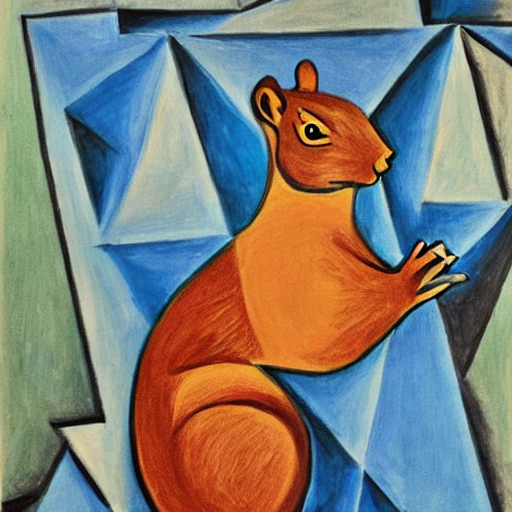

# Hugging Face 使用方法

!!! warning "本文正在编写中"

!!! info "声明"

    由于该文章为本人大一时为[“科学与社会”研讨课](https://www.teach.ustc.edu.cn/?attachment_id=17309)学习需要而创作。由于作者才疏学浅，在严谨性上可能存在缺陷。

## 前言

严格上来说，“使用 AI 做自己想做的事”和“理解、学习 AI 的原理”是两件截然不同的事情。这个难度的区别就好比在 [Steam](https://store.steampowered.com/) 上下载[《黑神话·悟空》](https://store.steampowered.com/app/2358720/Black_Myth_Wukong/)和编写这样的游戏一样。

使用 [Hugging Face](https://huggingface.co/) 中现成的模型完成文生图、图生图等任务明显属于前者，它的难度并不没有很多人想象中的那么大。我书写本篇文章的目的就是来证明使用现有的工具完成自己想完成的任务对于**有一定计算机基础的人**来说并不是遥不可及的事情，恰恰相反——我相信，在不远的将来，个性化计算 (personalized computing) 将会逐渐走近现实，人们将会对他们周围的电子产品有更多的自主权和控制权，能够熟练的运用电子产品完成自己想做的事情。

<!-- more -->

## 使用 Diffusers 进行文生图

!!! info "声明"

    如果你想要进行的是 AI 绘画，而后续不想与 Hugging Face 打太多交道，也不想训练自己的模型，那么 [Comfy UI](https://github.com/comfyanonymous/ComfyUI) 是一个更好的选择，请直接学习它，忽略本教程。

> 🤗 Diffusers 是一个用于生成图像、音频甚至分子3D结构的最先进预训练扩散模型的首选库。无论您是在**寻找一个简单的推理解决方案**，还是想训练自己的扩散模型，🤗 Diffusers 都是一个支持两者的模块化工具箱。我们的库设计时注重**可用性**而非性能，**简单**性而非易用性，以及可定制性而非抽象性。
>
> ——使用 [DeepSeek](https://chat.deepseek.com/) 翻译自 [Diffusers 官方教程](https://huggingface.co/docs/diffusers/index)

Hugging Face 的官网给出了一部详细的 [Diffusers 库使用教程](https://huggingface.co/docs/diffusers/index)。这个教程涵盖的范围包括从使用现成的模型生成图片，到使用数据训练自己的模型的各方各面（不包括原理）。官网上的教程非常详细，是优秀的学习资源。本文旨在从与原教程不同的角度，即实用的态度，来看待 Diffusers 这款工具。

首先根据[教程](https://huggingface.co/docs/diffusers/installation)安装好 Diffusers，这是以下所有实践的前提。

### 从小模型开始

Pipeline 是 Diffusers 库为我们方便运行各种模型（不限于文生图模型）提供的一个有用的工具。以下大部分内容翻译自[官方教程的《概览》部分](https://huggingface.co/docs/diffusers/quicktour)，如果想对 Pipeline 有更深的了解可以参考这个 [Google Colab](https://colab.research.google.com/github/huggingface/notebooks/blob/main/diffusers/diffusers_intro.ipynb)。

!!! warning "请注意您的显卡内存"

    以下示例要求 **8 GB 及以上**的显卡内存才能正常运行！如果你的显卡内存低于这个值，请移步下一节。

这是[官网中教程](https://huggingface.co/docs/diffusers/quicktour#diffusionpipeline)中的第一个生成图片的示例，这个例子消耗了 7700 MiB 的显存（`nvidia-smi` 中结果）：

```py
from diffusers import DiffusionPipeline

pipeline = DiffusionPipeline.from_pretrained("stable-diffusion-v1-5/stable-diffusion-v1-5", use_safetensors=True)
pipeline.to("cuda")
image = pipeline("An image of a squirrel in Picasso style").images[0]
image
```

??? note "一张生成结果"

    

这个示例做的是：

- 第三行代码做的是从 Hugging Face 官网的存储库上下载 `stable-diffusion-v1-5` 这个模型（如果本地没有缓存的话），再把模型加载到 `pipeline` 里。
- 第四行代码把这个 `pipeline` 加载在[英伟达](https://www.nvidia.com)显卡上。
- 第五行代码根据提示词，运行这个 `pipeline`，生成了一张图片。
- 最后一行代码展示了这张图片。

`DiffusionPipeline`，顾名思义就是运行扩散模型 (diffusion) 模型的流水线，这是真哥哥 Diffusers 库中最基本的 Pipeline！也就是说，其他所有的“流水线”都是它的派生。出于本文性质原因，这里不用篇幅专门介绍什么是扩散模型。很多模型在 Diffusers 库中都有相应的 Pipeline，[这里](https://huggingface.co/docs/diffusers/api/pipelines/overview#diffusers-summary)有一个详细的表格。

### 减少显存使用

你可能会发现刚才的 `stable-diffusion-v1-5` 已经是一个比较小的模型了——在未经优化的情况下能够在 8GB 显存的显卡上运行。可是，Hugging Face 还有那么多模型没有办法运行怎么办？（如果你尝试在家用电脑上运行过官网上的教程，你可能碰到过很多 `OutOfMemoryError`）幸运的是，我们可以从模型本身和运行方式上入手，缩小运行模型所需要的显存占用。

#### 量化

量化 (quantization) 的意思是，用较少的信息来表示数据，同时尽量不损失过多的准确性。比如说，如果一个模型的权重以 `torch.float32` 存储，把它们量化为 `torch.float16` 就可以使模型大小减半，从而容易更容易存储并减少内存使用。较低的精度还可以加速推理过程。这类方法之所以常用是因为在很多机器学习模型中，参数的精度并不重要（或者至少不处于关键位置）

具体量化的使用方法参见 [官方文档的《量化》章节](https://huggingface.co/docs/diffusers/v0.32.2/en/quantization/overview)。量化有很多方法，除了用 16 位浮点数其中官方文档中介绍的有 bitsandbytes、gguf 和 torchao。

下面我们改进了上面的代码，使用了 16 位浮点数量化优化以上示例的内存，把内存占用从未经优化的 7700 MiB 优化到了 3980 MiB！

```py
from diffusers import DiffusionPipeline
import torch

pipeline = DiffusionPipeline.from_pretrained(
    "stable-diffusion-v1-5/stable-diffusion-v1-5",
    torch_dtype=torch.bfloat16,
    use_safetensors=True)
pipeline.to("cuda")
image = pipeline("An image of a squirrel in Picasso style").images[0]
image
```

??? note "一张生成结果"

    

    可以看到，量化并没有明显地降低生成质量（虽然这张照片和上面一张一样，都是稍微挑过的，不太严谨，但是结论是对的）

使用精心设计、更加激进的量化方法，可以进一步地优化模型占用的内存，具体参见[官方文档中关于 bitsandbytes 的介绍](https://huggingface.co/docs/diffusers/quantization/bitsandbytes)。

#### 其它的优化方法

具体参见[官方文档的《优化内存》章节](https://huggingface.co/docs/diffusers/optimization/memory)，下面是对这些优化方法的极其粗略的介绍：

- `pipeline.enable_vae_slicing()`：生成多张图片时内存不够可以采用此选项。
- `pipeline.enable_vae_tiling()`：生成很大的图片的时候可以采用此选项。
- `pipeline.enable_model_cpu_offload()` 和 `pipeline.enable_sequential_cpu_offload()`：都是把部分参数存在内存里，根据需要“搬运”到显存中去，但这两个选项的程度不同，后者对显存的节省程度最大，对性能的影响也最大。

学会这些优化方法之后，就可以尝试运行更大的模型了。

## 微调模型和上传自己的模型

!!! warning "此处内容待完成"

## Hugging Face CLI

!!! warning "此处内容待完成"
