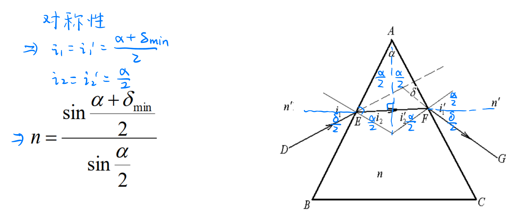
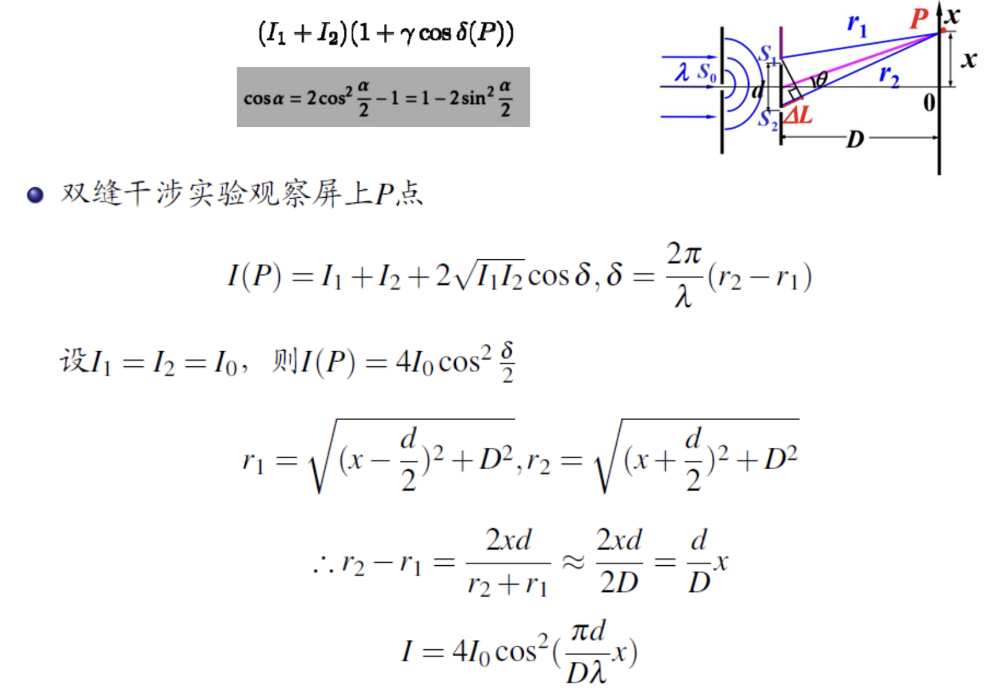
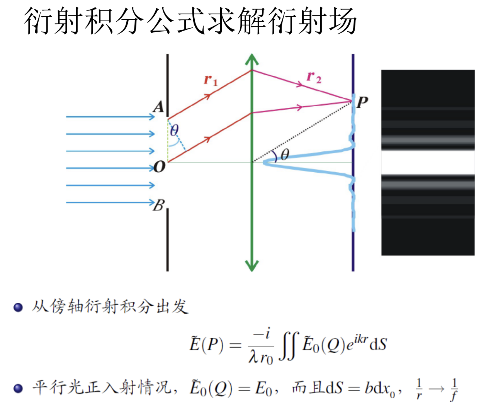

# 《量子物理》课程笔记

最近看到身边同学「上课时向 Gemini 提问」这种学习方式受到启发，深感自己 iPad 手写笔记这种方式有许多不便；照说这种类型的「互动」可以增加学习效率和加强学习效果；这一篇文章即是我将这一方法在本学期课程上的实践

> 《量子物理》是科大物理通修课程「减负」改革后，信息、智能类专业的物理必修课四部曲之终章，它体现着科大数理基础特色，在科大学生界享有盛誉。

<!-- more -->

## 光学部分

光学的分类：几何光学 (ray optics)、波动光学 (wave optics)、量子光学 (quantum optics)

### 几何光学

- **成立条件**：尺寸条件 ($D\gg \lambda$)、强度条件（光强不能太强）
- **三大定律**：*直线传播定律*、*独立传播定律*、*反射和折射定律*
- **Fermat 原理** (Fermat's Principle) 是几何光学部分的核心——直线传播定律，反射和折射定律都可以由其推导得出。

> 强光下，介质的折射率不再是常数 (Kerr effect)，产生自聚焦 (self-focusing) 现象；可能发生波长漂移（倍频效应）；光束之间可能通过介质发生相互作用，使得独立传播定律不再成立。
> 
> 光学的这个分支，我们称为**非线性光学** (nonlinear optics)

> [!NOTE]- 例题：证明棱镜折射率 $n$ 与最小偏向角 $\delta_\text{min}$ 的关系
> 

- 折射定律 (Snell's law): $n_1\sin i_1 = n_2\sin i_2$

#### Fermat 原理

- 光程：$\mathrm dl = n\mathrm ds$，折射率与几何长度的乘积；
- Fermat 原理：在所有可能的光传播路径中，实际路径所对应的光程取极值（平稳值）。
- 重要推论：物像等光程

$$
\delta L = \delta\int^P_Qn\mathrm dl=0
$$

#### 光学成像

在这节中，我们只研究*傍轴条件*下*球面*以及由球面组成的系统的成像问题；我们需要掌握傍轴球面，薄透镜（及其作图方法），以及共轴球面系统

- **理想成像**：条件为*同心性不变*和*等光程成像*；理想成像的光具组叫做**理想光具组**，任何理想光具组都一定有一个**光心**；
- **单个球面**：近轴光在单个球面下的成像：$\frac{n}{s^\prime} + \frac{n^\prime}{s^\prime} = \frac{n^\prime - n}{r}$，注意符号约定；
- **薄透镜**：磨镜者公式以及焦度 (diopter) 可加性；
- **共轴球面系统**：可以看作一个具有「厚度」的薄透镜，「传送门」的两面分别为物/像方主平面 (principle object/image plane)

$$
\begin{aligned}
& \qquad\qquad\qquad\frac{n}{s} + \frac{n^\prime}{s^\prime} = \frac{n^\prime - n}{r}\\
& 物方焦距\quad s\to+\infty,\quad f^\prime = \frac{n^\prime}{n^\prime - n}r = \frac{n^\prime}{\color{blue}\Phi}{\color{blue}\cdots焦度~(屈光度)}\\
& 像方焦距\quad s^\prime \to + \infty,\quad f=\frac{n}{n^\prime - n}r = \frac{n}{\Phi} \\
&\qquad\qquad\implies\quad\frac{f}{s} + \frac{f^\prime}{s^\prime} = 1\quad(适用于任何理想光具组) \\
& 在薄透镜中，焦度\text{ (diopter) }可加: \\
&\qquad ~~\quad \Phi = \Phi_1+\Phi_2 = \frac{n_L - n}{r_1} + \frac{n^\prime - n_L}{r_2},\quad n=n^\prime=1~时:\\
&\implies \quad f = \frac1\Phi=\frac{1}{\frac{n_L - 1}{r_1}+ \frac{1 - n_L}{r_2}}=\frac{1}{(n_L-1)(\frac{1}{r_1} - \frac{1}{r_2})}
\end{aligned}
$$

$$
xx^\prime = f f^\prime
$$

### 波动光学

波动光学的研究逻辑：将光表示为若干个光源的叠加——用叠加后的方程来解释光现象

#### 定态光波

$$
\begin{gather}
U(z, t) = A\cos(\omega t - kz + \varphi_0)\\
\lambda = VT,\quad \underbrace{k}_\text{波矢}=\frac{2\pi}{\lambda}
\end{gather}
$$

单色光波可以表示为：

$$
\begin{cases}  
\vec{E}(\mathbf{r},t) = \vec{E}_0(\mathbf{r}) \cos\bigl[\omega t - \varphi(\mathbf{r})\bigr] \\
\vec{H}(\mathbf{r},t) = \vec{H}_0(\mathbf{r}) \cos\bigl[\omega t - \varphi(\mathbf{r})\bigr]  
\end{cases}  
$$

| 波类型 | 波函数形式                                                   | 波矢/波面特点     | 振幅特点         |
| --- | ------------------------------------------------------- | ----------- | ------------ |
| 平面波 | $\vec{E}_0 \cos(\omega t - \mathbf{k}\cdot \mathbf{r})$ | 波矢固定方向，波面平面 | 振幅恒定         |
| 球面波 | $\frac{\vec{E}_0}{r} \cos(\omega t - k r)$              | 波矢沿径向，波面球面  | 振幅随 $1/r$ 衰减 |

#### 复振幅表示

$$
U(\mathbf{r},t) = \text{Re}\big[\tilde{U}(\mathbf{r}) e^{-i\omega t}\big],\quad
\tilde{U}(\mathbf{r}) = A(\mathbf{r}) e^{i \varphi(\mathbf{r})}
$$

$\tilde{U}(\mathbf{r})$：**复振幅**，包含了空间位置 (\mathbf{r}) 的**振幅 $A(\mathbf{r})$** 和**相位 $\varphi(\mathbf{r})$**；

$$
\begin{gather}
\text{平面波：} & \tilde{U}(\mathbf{r}) = A_0 e^{i \mathbf{k}\cdot\mathbf{r}}\\
\text{球面波：} & \tilde{U}(\mathbf{r}) = \frac{A_0}{r} e^{i k r}\\
\end{gather}
$$

光强可以直接由复振幅的模平方给出
$$
I(\mathbf{r}) \propto |\tilde{U}(\mathbf{r})|^2
$$

#### 光的干涉

- **干涉条件**：同频率、同振向（振动方向一致或有平行的振动分量）、有稳定的相位差
- **光强分布基本公式**：$I=I_1+I_2+2\sqrt{I_1I_2}\cos\delta(P)$，其中 $\delta(P)=\varphi_2(P)-\varphi_1(P)=k(r_2-r_1)-(\varphi_{20}-\varphi_{10})$
- **相位/光程差判据**：
	- $\delta(P)=2m\pi~(m=0,\pm1,\pm2,\cdots)$ 时，光强取极大值；
	- $\delta(P) = (2m+1)\pi~(m=0,\pm1,\pm2,\cdots)$ 时，光强取极小值；
	- $\Delta L=m\lambda_0$，干涉极大；
	- $\Delta L=(m+\frac12)\lambda_0$，干涉极小；

现实生活中光源的发光是量子化的，原子发光的时间往往 $\Delta t =10^{-8} \sim 10^{-10}~\mathrm s$，每次发光相互独立，各波列互不相干；所以，往往发生的是*暂态干涉*

- 普通光源获得相干光的途径：*分波前法*（Young 氏实验）和*分振幅法*（薄膜干涉、Michaelson 干涉仪）

非严格单色光的 Young 氏干涉：

$$
\begin{aligned}
& \quad \lambda \sim \lambda + \Delta \lambda\\
& \quad\Delta_\text{max} = j(\lambda+\Delta\lambda) = (j+1)\lambda \\
& \implies j_\text{max}=\frac{\lambda}{\Delta \lambda}\\
& \implies L_0=\Delta_\text{max}=\frac{\lambda^2}{\Delta\lambda}\cdots相干长度
\end{aligned}
$$

> [!NOTE]- 其它的干涉仪
> 
> 

#### 薄膜干涉

- 薄膜干涉分为*等厚干涉*和*等倾干涉*
- **分振幅法**：一束光投射到分束器，使光能流一部分反射，一部分折射，再使这两束光发生交叠

#### 光的衍射

- 衍射是一种特殊的干涉现象；
- 光的衍射强弱主要取决于障碍物（或缝隙）尺寸与波长的比值 ρ/λ：
	- $ρ/λ ≳ 1000$ → 衍射很弱，几乎看不出  
	- $ρ/λ ≈ 10\sim1000$ → 衍射明显，最经典的单缝、圆孔衍射现象  
	- $ρ/λ ≲ 1$ → 衍射过渡到散射（尤其是当 $ρ ≪ λ$ 时，接近瑞利散射）
- 衍射的模型：
	- 基本思想—Huygens-Fresnel 原理
	- Kirchhoff 衍射公式—近场衍射
	- Fraunhofer 衍射公式—平行光假设

#### 圆孔衍射和 Rayleigh 判据

#### 光的偏振
- **偏振态**：光矢量在垂直于传播方向的平面内的振动状态
- 偏振光分为*线偏振光*、*圆偏振光*、*椭圆偏振光*
- **自然方向**：振动方向随机变化
- **部分偏振光**：振动方向在随机变化，但存在优势方向
	- 单色部分偏振光的偏振态可以用四个 Stokes 参数表示
	- 偏振度：$P=\frac{I_\max - I_\min}{I_\max + I_\min}$

获得偏振光或者鉴别偏振光，需要**起偏器**：
- 微晶型线起偏器：电气石，硫酸碘奎宁晶体
- 分子型线起偏器
- 玻片堆起偏

光在反射、折射的过程中，其偏振的情况会发生改变——Fresnel 折射公式；Brewster 角 $\theta_b = \arctan\frac{n_2}{n_1}$

#### 光的双折射

- 晶体的**光轴**：沿此轴不会发生双折射；晶体可能有一个或两个光轴
- 波晶片

## 原子模型

### 黑体辐射

- 辐射本领：$E(\nu, T)$
- Kirchhoff 吸收定律：
