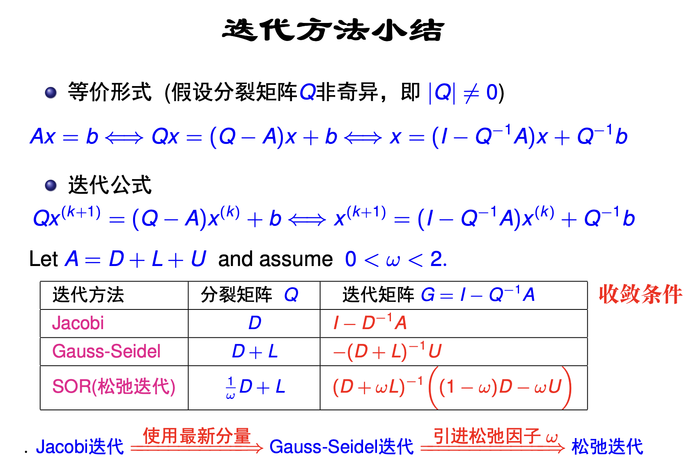

# 《计算方法》课堂笔记

<!-- more -->

## 线性方程组的解法

线性方程组的解法分为*直接法*和*迭代方法*，

### Gauss 消元

### 迭代法

- **收敛条件**，除了通用的谱范数和范数：
	- Jacobi：占优（充分）
	- Gauss-Seidel：占优（充分），正定（充分）
	- SOR：$0< \alpha < 2$（充分），占优且 $0< \alpha < 1$（必要），正定且 $0< \alpha < 2$（充要）

## 非线性方程的求解
