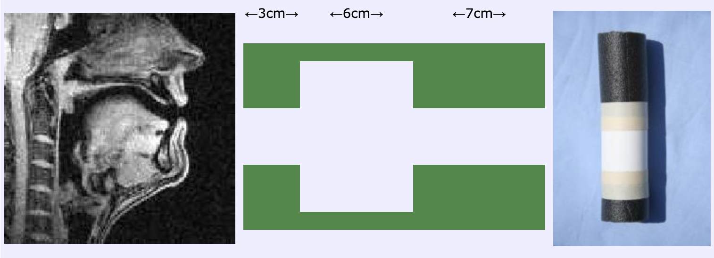

# 语言科学

《语言科学》由袁家宏教授讲授，主要覆盖语音学，音系学，句法学（未完待续）等方向的语言科学的知识，是一门导论性质的通识课程，下面是我对这门课程的笔记。

<!-- more -->

## IPA 和语音转写

### 语音转写的历史

### IPA

### 语音转写

- 语音转写 Phonetic transcrption—用 `[]` 表示，以音素 Phone 为单位；
- 音位转写 Phonemic transcription—用 `//` 表示，以音位 Phoneme 为单位；
- *ToBI (Tone and Break Index)* 是一个语调转写系统
- 汉语声调会使用改进的 ToBI 系统（如 C-ToBI, Pan-Mandarin ToBI，等）

## 语音学

### 语音学的历史

- 口耳语音学（Aṣṭādhyāyī of Pāṇini)
- 实验语音学：发音语音学 Articulatory Phonetics、声学语音学 Acoustic Phonetics、听觉语音学 Auditory Phonetics

### 声学语音学

- 声源-滤波模型
- 元音—基频，共振峰，音高
- 辅音—湍流 turbulence，冲击波 shock wave
	- 塞音—共振峰过渡，*核心区 Locus*（类比元音共振峰）
	- `[k]` 软腭捏 velar pinch

- https://markhuckvale.com/vowels/
- https://home.cc.umanitoba.ca/~robh/howto.html

### 声源-滤波模型

下面只介绍由若干个圆筒拼接而成的系统：



我们假设筒内只有沿圆筒轴向传播的平面波（所有波都沿轴向传播，这是以下我们证明的前提）

#### 声音的传播

首先我们要推导用来描述声波的方程，回忆热学中学到的**绝热过程** (adiabatic process)，绝热过程中，我们有：

$$
p=K\rho^\gamma
$$

其中 $\gamma$ 是比热容比，对于理想气体，$\gamma$ 是取决于分子自由度的常数（这点应该要回忆起来）。在线性声学的前提下，我们认为：

$$
p = p_0 + p^\prime,\quad \rho = \rho_0 + \rho^\prime
$$

将这个小扰动假定带入方程，我们可以得到：

$$
\begin{gather}
p = K\rho^\gamma \\
p_0+p^\prime=K(\rho_0+\rho^\prime)^\gamma \\
\implies p_0+p^\prime = K\rho_0^\gamma + K \gamma \rho_0^{\gamma-1}\rho^\prime + o(\rho^\prime) \\
\text{带入静息状态下的}~p_0=K\rho_0^\gamma\text:\\
\implies p^\prime\approx K\gamma\rho_0^{\gamma-1}\rho^\prime=\gamma\frac{p_0}{\rho_0}\rho^\prime
\end{gather}
$$

根据**绝热声速** (adiabatic sound speed) 的定义 $c^2 = \left(\frac{\partial p}{\partial \rho}\right)_s$，我们可以得到：

$$
p^\prime = c^2\rho^\prime
$$

直观上理解，这个方程的含义是——压强的微小改变与密度的微小改变成正比，将该式子带入空气的连续性方程和动量守恒方程，可以得到一维波方程：

$$
\begin{gather}
\frac{\partial \rho^\prime}{\partial t} + \rho_0\frac{\partial u}{\partial x} = 0,\quad \rho_0\frac{\partial u}{\partial t} = -\frac{\partial p^\prime}{\partial x}\\
\implies \frac{\partial^2 p'}{\partial x^2} = \frac{1}{c^2}\frac{\partial^2 p'}{\partial t^2}
\end{gather}
$$

#### 系统的分析

使用线性时不变系统的方式分析这个系统，在频域上对每个频率分别分析：

$$
\begin{gather}
p'(x,t) = \Re\{P(x)e^{j\omega t}\}, \quad
u(x,t) = \Re\{U(x)e^{j\omega t}\} \\
\implies \tilde p(x,t)= P(x)e^{j\omega t} \\
\implies \frac{\partial \tilde p}{\partial x} = P^\prime(x)e^{j\omega t},\quad \frac{\partial^2 \tilde p}{\partial x^2}  = P^{\prime\prime}(x)e^{j\omega t}\\
\frac{\partial \tilde p}{\partial t} = j\omega P(x)e^{j\omega t},\quad \frac{\partial^2 \tilde p}{\partial t^2}=-\omega^2P(x)e^{j\omega t}
\end{gather}
$$

带入刚才的一维波方程可以得到：

$$
\begin{gather}
P^{\prime\prime}(x)e^{j\omega t}=\frac{1}{c^2}(-\omega^2P(x)e^{j\omega t}) \\
\implies \frac{\mathrm d^2 P}{\mathrm dx^2}+k^2P =0,\quad\text{where}~k=\frac{\omega}{c}
\end{gather}
$$

有通解：

$$
P(x)=P^+ e^{-jkx}+P^-e^{jkx}
$$

#### 单根管

- 长度为 $L$ 的管，头位于 $x=0$ 处，尾位于 $x=L$ 处：

$$
\begin{gather}
p_{\text{in}} = P(0)=P^+ + P^-, \\
\mathcal U_{\text{in}} = \mathcal U(0)=\frac{1}{Z_c}(P^+ - P^-). \\  
p_{\text{out}} = P(L)=P^+e^{-jkL}+P^-e^{jkL}, \\
\mathcal U_{\text{out}}=\frac{1}{Z_c}(P^+e^{-jkL}-P^-e^{jkL}).  
\end{gather}
$$

其中 $\mathcal U_\text{in}$ 和 $\mathcal U_\text{out}$ 都表示流速（体速度），$Z_c$ 是声波阻抗，定义为 $\frac{\rho c}{A}$，解这四个方程我们可以得到：

$$
\begin{gather}
\begin{bmatrix}
p_\text{out} \\
U_\text{out}
\end{bmatrix}
=
\begin{bmatrix}
\cos(kL) & -jZ_c\sin(kL) \\
-\dfrac{j\sin(kL)}{Z_c} & \cos(kL)
\end{bmatrix}
\begin{bmatrix}
p_\text{in}\\
U_\text{in}
\end{bmatrix} \\
\begin{bmatrix}
p_\text{in} \\
U_\text{in}
\end{bmatrix}
=
\begin{bmatrix}
\cos(kL) & jZ_c\sin(kL) \\
\dfrac{j\sin(kL)}{Z_c} & \cos(kL)
\end{bmatrix}
\begin{bmatrix}
p_\text{out}\\
U_\text{out}
\end{bmatrix}
\end{gather}
$$

#### 多圆管系统

$$
\begin{gather}
\mathbf{T}_i(\omega)=
\begin{bmatrix}
\cos(kL_i) & j Z_{c,i} \sin(kL_i) \\
j \dfrac{\sin(kL_i)}{Z_{c,i}} & \cos(kL_i)
\end{bmatrix} \\
\mathbf{T}_{\mathrm{total}}(\omega)
=
\mathbf{T}_1(\omega)\mathbf{T}_2(\omega)\cdots\mathbf{T}_N(\omega)
=
\begin{bmatrix}
A(\omega) & B(\omega) \\
C(\omega) & D(\omega)
\end{bmatrix}
\end{gather}
$$

一旦我们得到了整个系统的转移矩阵，我们就可以带入边值条件得到响应曲线。在开放端，我们有发射阻抗 (radiation impedance)：

$$
p_{\mathrm{out}} = Z_{\mathrm{rad}}(\omega) U_{\mathrm{out}}
$$

将该关系带入：

$$
\begin{bmatrix}
p_{\mathrm{in}} \\
U_{\mathrm{in}}
\end{bmatrix}
=
\begin{bmatrix}
A & B \\
C & D
\end{bmatrix}
\begin{bmatrix}
p_{\mathrm{out}} \\
U_{\mathrm{out}}
\end{bmatrix}
$$

我们可以得到：

$$
H(\omega)
=
\frac{U_{\mathrm{out}}}{U_{\mathrm{in}}}
=
\frac{1}{C(\omega)Z_{\mathrm{rad}}(\omega) + D(\omega)}
$$

在管道开放的情况下，$Z_{rad}(\omega)=0$，此时 $H(\omega) \approx \frac{1}{D(\omega)}$，$D(\omega)\approx0$ 处的点就是元音的共振峰。

## 音系学

- 音系学 Phonology—研究语言中的语音结构
- 汉语的音系学和音韵学
- 音素 phone 与音位 phoneme 之对立；音韵分析 phonetic analysis
- 音位变体 allophone
- 音系规则 phonological rules；音系规则有一定的表示形式
	- 自然类 natural class：音系规则中常见的类别，鼻音 nasals 阻塞音 obstruents 唇音 labials 咝音 sibilants
- 区别特征 distinctive features：布拉格学派

音位分析的原则：
1. 对立原则——对立 contrastive 的音素必须归纳为不同的音位
	- 互补 complimentary 的两个音素可以归纳为同一个音位（如 spin/pin）
2. 互补原则
3. 相似性原则和系统性原则（比如汉语中的 j/q/x zh/chi/shi）
4. 蕴含原则 implicational law

- 语流音变：同化 assimilation 插入 insertion 删除 deletion 加强 strengthening 减弱 weakening 位置交换 metathesis
- 语流音变和语言演化的关系
- 优选论 optimality theory——相比于 Rule-based phonology

https://wals.info

### 汉语的四呼

**四呼**是汉语音韵学中的概念

- 汉语的结构分为声母+韵母（介音（开合、等），韵腹，韵尾）+声调；
- 韵腹和韵尾统称韵，韵和声调统称声调
- 开口呼，齐齿呼，合口呼和撮口呼


### 自动语音分析

自动 IPA 转写、自动音位分析、自动声调转写、自动调类分析对于现阶段机器学习是一个较为困难的任务

### 发音音系学

在发音音系学 articulatory phonology 中，语音的基本单位是音势 gestures，而非音素；


## 词法学

- 词 word 是一种语言中能够独立运用的最小的音义结合体
- 词位 lexeme / 词形 word form / 形符 token（文本中每一次实际出现） / 类符 type（文本中不重复的词项）
- 词的边界——儿童语言习得
	- 当前主流观点认为，词边界识别是一个多线索整合的过程
	- 统计学系和韵律线索通常被看作最核心的两类机制
- 词类 part of speech：很多语言都有各自的词语分类
	- 拟声词 onomatopoeia，比如喵/meow/ニャン(nyan)；公鸡的拟声词在各国间差异较大
- 语素 morpheme——一种语言中最小的音义结合体
	- 语素的分类：自由语素 free morpheme 黏着语素 bound morpheme
	- 语素变体：语素变体 allomorph
- 构词法 morphological processes
	- 词根 stem / 词干 stem / 词缀 prefix suffix infix circumfix
	- 异干交替 suppletion
	- 复合词（汉语有联合式、偏正式、主谓式、动宾式、补充式）
	- 超音段 suprasegmental
- 词法分析 morphological analysis

- 按照词法，语言可以分为分析性 (analytic languages) 和综合型 (synthetic languages)
	- isolating / agglutinating / fusional / polysynthetic
- 词的分词结构

## 句法学

### 生成句法学

- 句子 sentence 是语言中表达一个完整意思的单位
- 一个语言中一般有 10000-50000 个语素
- 组合性 compositionality（需要顾及意义）和合法性 grammaticality（不需要顾及意义）

在 Chomsky 看来，语言学的研究对象是内化语言 Internal language，对应语言能力 language competence 而非语言运用 language performance

- 句法范畴 syntactic categories：在句子中具有相同功能的词或者短语——比如名词、动词、限定词 determiner
	Noun 和 Noun Phrase，比如 Furry cat 和 The cat
- 句子是最大的句法范畴
- 词汇入口

句法规则的种类：

- Head 中心语 rules，如 `VP -> V / TV NP / DTV NP NP`
	- Head-initial / -final
- Adjunction 附加语 rules，如 `VP -> VP Adv`（递归）
- Exocentric 离心 rules：如 `S -> NP VP`

根据句法规则，我们可以从两个角度分析语言：

- 生成 generation；生成句法又称为 Chomsky 句法
	- Transformational generative grammar
	- ……
	- Minimalist program 语言是进化出来的最简单、最经济的计算系统
- 句法分析 parsing

递归 recursion：
- https://www.science.org/doi/10.1126/science.298.5598.1569 思想：Recursion 是人类 Language Faculty 的独有功能
- https://www.science.org/doi/10.1126/science.1089401 对非人灵长类的实验，Finite State Grammar 与 Phrase Structure Grammar，非人灵长类只能识别正则语法

### 依存句法学

Chomsky 句法学的问题：语言有很多模糊性，比如：

```
李四，我认识很多喜欢的人
这道题，我没见过做出来的人（两个句子结构相同）

x不了一点儿（难以用一般理论解释）
```

*The empirical base of linguistics*

- 依存结构 dependency structure（可参考 attention 机制）
- 依存语法 dependency grammar
- 依存关系——定义为核心词 head 和依存词 dependent 之间的关系
	- 每个词都依附于其它核心词
	- 有且仅有一个词依赖于 root
	- 依存弧呈树形结构
	- （有些语言具有的）**投射性** projectivity 依存弧之间没有交叉；projective 依存关系可以转化为短语结构 context free grammar
- 依存距离
	- 依存距离最小化 dependency length mininmization 假设
		https://www.pnas.org/doi/10.1073/pnas.1502134112
- 依存树刻画的关系不如生成句法树完备

依存关系与大语言模型：
- `Do you know who stole the crown jewels?`

### 句法复杂度
- 基于短语结构—Yngve score / Frazier score / Frequency counts (14 种)
- 基于依存结构—MDD, Mean dependency distance—平均依存距离

*Automated Measures of Syntactic Complexity in Natural Speech Production...*


树库：

- 生成句法学：Treebanks—Penn Treebank
- 依存句法学：Universal dependencies
- Constituency Parsing / Dependency Parsing

歧义：

- 词语歧义
- 结构歧义 structural ambiguity

*When the LM misunderstood the human chuckled: Analyzing garden path effects in humans and language models*

## 语义学

语义学分为词汇语义学 lexical semantics（研究词的涵义和所指）和句子语义学 sentential semantics（分为组合语义学和形式语义学）

### 词汇语义学

语言学中的「意义」分为**涵义** (sense) 和**所指** (reference)：

- 有的表达只有涵义而无所指，e.g unicorn, the first person on Mars
- 有的表达涵义不同，但所指相同，e.g The most populous country in the world in 2008, The country that hosted the 2008 Olympics


涵义的 Usage-based Definitions

> The meaning of a word is its use in the language — Ludwig Wittgenstein (1953)
> 
> If [words] A and B have almost identical environments [...] we say that they are synonyms — Zellig Harris (1954)
>
> You shall know a word by the company it keeps — John Firth

- 词的意义关系：上下义关系 (hypernym-hyponym)、同义关系、反义关系、相似性、关联性、内涵
- Linguistic Principle of Contrast 没有绝对的同义关系，所指可能相同，但涵义不能完全相同 Abbé Gabriel Girard, 1718
- 反义关系分为互补反义 complementary antonymy 和等级反义 gradable antonymy
- 相似性 similarity/相关性 association
- 内涵 connotation：词语在 Valence（词语的褒义程度）, Arousal（情绪化程度）, Dominance（控制感程度） 三个维度有所区分 *NRC VAD Lexicon*

- Semantic feature vector / (static/contextual) word embedding
- *Diachronic Word Embeddings Reveal Statistical Laws of Semantic Change*

### 组合语义学

比如，形容词和名词间有 intersective adjectives, subsective adjectives (small whales/tall person) 以及 non-intersective adjectives (alleged criminal/fake gun)

non-intersective 的存在说明句法结构和语义结构并不一定对齐

- 句子的 sense 和 reference；理解这句话=knowing its truth conditions
- Scope Ambiguity of Quantifiers—wide scope/narrow scope

## 语用学

什么是语用学 Pragmatics？(Why is Pragmatics called Wastebasket)

- Context: Linguistic ~ / Situational ~ / Social ~
- deixis / presumption / implicature（含义）/ irony
- *PUB: A Pragmatic Understanding Benchmark for Assessing LLMs' Pragmatic Capabilities (ACL2024)*
- *Do Large Language Models Understand Conversational Implicature — A case study with a Chinese sitcom*
- 言语行为 Speech Acts

## 语言学的其他分支
### 社会语言学

- Dialect 方言和 Idiolect 个人方言
- **方言**分为**地理方言**（地理语言学/方言学）和**社会方言**

- e.g. The Northern Cities Vowel Shift
- The Social Stratification of (r) in New York City Department Stores
- Intonation variation in the British Isles
- Uptalk in American English
- Language change across the life span (Queen's English, /r/ in Montreal French)


Variationist/Labovian Sociolinguistics：语言不是同质而是有序异质的（orderly heterogeneity）

### 汉语方言和声调
- 目前世界上接近一半的语言都是声调语言
- 声调与基因有关吗 https://doi.org/10.1073/pnas.0610848104

- 汉语方言调类的数目
- 浊上归去
- 声调的起源：韵尾说、声母说、元音说

汉语史的分类：上古汉语（《诗经》）、中古汉语（《切韵》）、近代汉语（《中原音韵》）、现代汉语