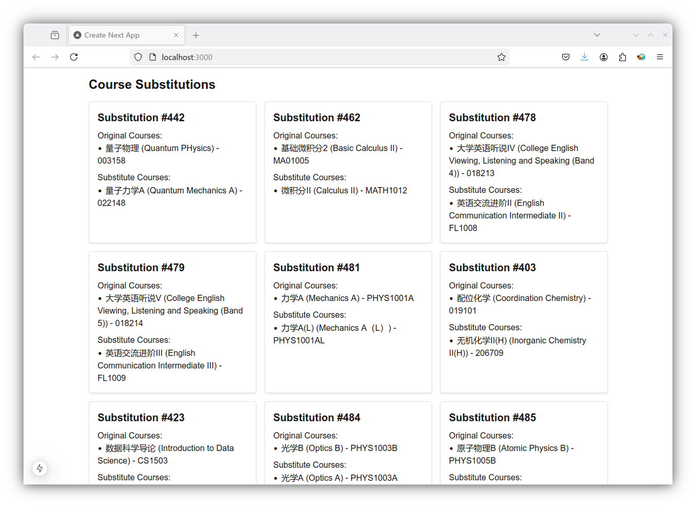
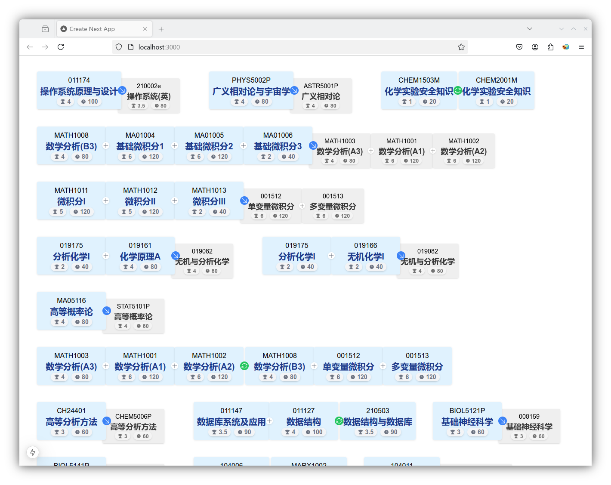

# 初探 Web App 实现

!!! warning "本文正在编写中，并且可能长时间处于这一状态"

!!! info "声明"

    经过两天的实践，作者已经发现在现在的条件下，把**朴素的想法转化为一个使用的程序**仍然是一个**复杂**的过程。

    目前 Copilot 已经可以在短时间内**生成初始代码**，但是对于**前端界面**的编写，Copilot 还是相当无力的。因为 Copilot 是文字界面，你很难准确地用语言表达你对前端设计的想法。这一部分我也耗费了大量的时间。

    当前这个课程替代助手还停留在“**展示所有替代关系**”的阶段，短时间内不打算进行进一步的开发。

<!-- more -->

相信很多科大的学生都用过[Vtix在线答题](https://ti.u5tc.cn/#/)来准备入学考试和思想道德与法治的机试。

上过计算机程序设计 A 进阶班的同学都写过大作业。大作业的难度相信大家都深有体会，很多代码动辄几千行甚至上万行。比如我写的游戏[《蛇卷卷和鱼摆摆》](https://github.com/xinchengo/GameDemo)就有 [3000 行代码](https://github.com/xinchengo/GameDemo/graphs/contributors)，其中编写过程中还删除了一半的源代码。虽然很多大作业在实现难度上远大于[Vtix在线答题](https://ti.u5tc.cn/#/)、[蜗壳排课工具](https://paike.feixu.site/)，但是在实用性上却没有一个可以比上这两个轻量级的工具——很多大作业在开发完毕后就停止维护了，而这两个工具至今还是在科大校园中广为人知——虽然它们都是名副其实的“轻量级”工具，后者的代码量甚只有几百行。

这两个在学校受欢迎项目的例子表明，开发项目并不追求项目本身有多复杂，而是要能**找准用户的需求点**。这一点在 [Github Copilot](https://github.com/features/copilot) 等代码辅助生成工具飞速发展的今天显得尤为重要，因为它拉低了软件编写的门槛——它使得好的想法、好的点子能够更快地**转化为现实**。

在这个寒假之际我就以常见的静态 Web App 为例，探讨如果有一个好的点子，如何快速地把自己的点子转化为 Web App。

由于博主本人之前从来没有接触过 [React](https://react.dev/), [Vue](https://vuejs.org/) 等 Javascript 框架（虽然听说过它们的名字），甚至没有什么 Javascript 编程的经历。这次初探的过程应该可以很好的反映初学者第一次接触静态网页开发的心理状态，也希望能给其他初学者带来指引的作用。

在下面的例子中，我将尽可能地使用 [Github Copilot](https://github.com/features/copilot) 作为辅助工具简化开发过程。

## 明确目标

我将以一个**课程替代助手**为例，探讨如何简单地实现一个 Web App，将想法转化为现实。现在我先解释课程替代助手具体是什么。

[USTC 教务处网站——公共查询——替代课程查询](https://catalog.ustc.edu.cn/query/substitute)这个网站中列举了 USTC 课程之间的**替代关系**。替代关系分为两种——**同级替代**和**高级替代**；同级替代关系表示 A 和 B 两组课程可以相互替换，而高级替代关系表示 A 这组课程可以替代 B 这组课程，但反之不然。

（下面是我的理解，不一定是正确的）替代关系可以用替换来理解，比如说，你选择了 `A,B,C,D` 四组课程，存在一个替代关系 `B,C<->E,F`，还有一个替代关系 `B<->G`，那么 `A,B,C,D` 等价于 `A,E,F,D` 或者 `A,G,C,D`，但是不等价于 `A,G,E,F,D`。总之，**一门课程只能计算一次**。

我计划实现的应用是一个课程替代助手——就是说，以[教务处官方查询界面](https://catalog.ustc.edu.cn/query/substitute)为范本，实现如下功能：

- 过滤掉不活跃/不存在的课程，即，近两年的培养方案中没有出现过的课程。
- 输入一个课程或者一组课程，显示所有跟这组课程相关的替代关系（包括能够根据传递性推断出的替代关系）

我们其实可以根据教务处官方网站得到的资料，预处理出一张过滤掉不活跃或者不存在的课程后的清单。之后在执行这个静态 Web App 的时候，直接查询预处理的表就可以了。这个做法实际上是一种**归约**的思想，将一个复杂的问题化归为一个更简单的问题。所以也可以根据这个画出实现这个项目的**路线图**：

1. 实现[教务处替代课程查询](https://catalog.ustc.edu.cn/query/substitute)中的最基本功能，即，根据一张列表显示课程替代关系；
2. 实现教务处[教务处替代课程查询](https://catalog.ustc.edu.cn/query/substitute)中的搜索功能，即，使用课程名称与编号查询与其有关的替代关系；
3. 实现数据的预处理，比如过滤不活跃/不存在的课程，以及输入一个课程或者一组课程，显示所有跟这组课程相关的替代关系。

## 第一步：一个显示替代关系的列表

!!! abstract "摘要"

    通过简单的提示词交流，Copilot 很快生成了一个具有基本显示替代关系功能的原型界面。

先根据[Next.js 安装教程](https://nextjs.org/docs/app/getting-started/installation)中提供的方法，新建一个名为 `ustc-csh` 的 `create-next-app@latest` 模板项目。

### 准备 ChatGPT 提示词润色器

我现在开始使用 [ChatGPT](https://chatgpt.com/) 和 [Github Copilot](https://github.com/features/copilot) 进行辅助开发。我们考虑让 ChatGPT 先修改我的提示词，再把修改后的提示词喂给 Copilot，以下是我草拟的用于“修改我的提示词”的 ChatGPT 的提示词：

> You are a professional prompt engineer especially experienced in prompting with AI code assistants.
>
> In the following conversations, I will give you some prompts I have written for Github Copilot Chat in VS Code, to assist the development of a static web application in Next.js and React.
>
> Because English is not my native language, the prompts may contain improper phrases or grammar mistakes. And your job is to eliminate them. Also, I'm not experienced in coding with AI, so you may have to modify the prompts to better elicit the performance of coding assistants.

由于[有研究](https://arxiv.org/abs/2402.14531)表明使用礼貌的语言有助于 ChatGPT 等工具产生高质量的回复，我们先用 ChatGPT 对这一段提示词进行修改，让提示词变得更加礼貌，使用提示词：

> Please rewrite the following paragraph to make it more polite:
>
> [OMMITTED]

输入 ChatGPT 后，我得到了以下修改版本的提示词，这是我[与这个 GPT 的聊天记录](https://chatgpt.com/share/6790af6d-2e80-8001-a17a-4b66cbba0556)：

> You are a highly skilled prompt engineer with specialized experience in working with AI code assistants.
>
> In our upcoming discussions, I will be sharing some prompts I’ve created for GitHub Copilot Chat within VS Code, which are intended to support the development of a static web application using Next.js and React.
>
> As English is not my first language, there may be occasional phrasing or grammatical errors in my prompts. I would greatly appreciate your assistance in correcting these. Additionally, since I am still learning to work effectively with AI coding assistants, I may need your expertise in adjusting the prompts to maximize their performance.

将这一个提示词输入新的 ChatGPT 对话，我们就可以得到一个**提示词润色器**了，后面由于篇幅原因，我只列举我和 Github Copilot 的对话，喂给 Copilot 的提示词大多已经过 ChatGPT 润色。

### 正式与 Copilot 对话

我：

> @workspace I want to create a static web app using the create-next-app@latest template in this workspace.
>
> The app will read course substitution data from an attached list.json file. Each entry in this file represents a substitution scheme, where Course Group A can be swapped with Course Group B.
>
> The web app should display this data in a responsive grid layout, showing the substitution relationships clearly.

Github Copilot:

> To create a static web app using the `create-next-app@latest` template and display the course substitution data from `list.json` in a responsive grid layout, follow these steps:
>
> 1. **Initialize the Next.js project**:
>    ```sh
>    npx create-next-app@latest my-static-web-app
>    cd my-static-web-app
>    ```
> 2. **Add `list.json` to the public directory**: Place your `list.json` file in the public directory of your Next.js project.
> 3. **Modify** page.tsx to fetch and display the data\*\*: Update the `Home` component to fetch the data from `list.json` and display it in a responsive grid layout.
>
>    ```tsx
>    import { useEffect, useState } from "react";
>
>    interface Course {
>      id: number;
>      cn: string;
>      en: string;
>      code: string;
>      period: number;
>      credits: number;
>    }
>
>    interface Substitution {
>      id: number;
>      substituteCourses: Course[];
>      originalCourses: Course[];
>    }
>
>    export default function Home() {
>      const [substitutions, setSubstitutions] = useState<Substitution[]>([]);
>
>      useEffect(() => {
>        fetch("/list.json")
>          .then((response) => response.json())
>          .then((data) => setSubstitutions(data));
>      }, []);
>
>      return (
>        <div className="container mx-auto p-4">
>          <h1 className="text-2xl font-bold mb-4">Course Substitutions</h1>
>          <div className="grid grid-cols-1 sm:grid-cols-2 lg:grid-cols-3 gap-4">
>            {substitutions.map((substitution) => (
>              <div key={substitution.id} className="border p-4 rounded shadow">
>                <h2 className="text-xl font-semibold mb-2">
>                  Substitution #{substitution.id}
>                </h2>
>                <div>
>                  <h3 className="font-medium">Original Courses:</h3>
>                  <ul className="list-disc list-inside">
>                    {substitution.originalCourses.map((course) => (
>                      <li key={course.id}>
>                        {course.cn} ({course.en}) - {course.code}
>                      </li>
>                    ))}
>                  </ul>
>                </div>
>                <div className="mt-2">
>                  <h3 className="font-medium">Substitute Courses:</h3>
>                  <ul className="list-disc list-inside">
>                    {substitution.substituteCourses.map((course) => (
>                      <li key={course.id}>
>                        {course.cn} ({course.en}) - {course.code}
>                      </li>
>                    ))}
>                  </ul>
>                </div>
>              </div>
>            ))}
>          </div>
>        </div>
>      );
>    }
>    ```
>
> 4. **Add Tailwind CSS for styling**:
>    Install Tailwind CSS and configure it in your project.
>
>    ```sh
>    npm install -D tailwindcss postcss autoprefixer
>    npx tailwindcss init -p
>    ```
>
>    Update `tailwind.config.js`:
>
>    ```js
>    /** @type {import('tailwindcss').Config} */
>    module.exports = {
>      content: [
>        "./pages/**/*.{js,ts,jsx,tsx}",
>        "./components/**/*.{js,ts,jsx,tsx}",
>        "./app/**/*.{js,ts,jsx,tsx}",
>      ],
>      theme: {
>        extend: {},
>      },
>      plugins: [],
>    };
>    ```
>
>    Add Tailwind directives to your CSS file (`app/globals.css`):
>
>    ```css
>    @tailwind base;
>    @tailwind components;
>    @tailwind utilities;
>    ```
>
> 5. **Run the development server**:
>    ```sh
>    npm run dev
>    ```
>
> Now, your Next.js app should fetch the course substitution data from `list.json` and display it in a responsive grid layout.

我：

> @workspace /fix ./app/page.tsx:1:21
> Ecmascript file had an error
>
> > 1 | import { useEffect, useState } from 'react';
>
>     |                     ^^^^^^^^
>
> 2 |
> 3 | interface Course {
> 4 | id: number;
>
> You're importing a component that needs `useState`. This React hook only works in a client component. To fix, mark the file (or its parent) with the `"use client"` directive.
>
> Learn more: https://nextjs.org/docs/app/api-reference/directives/use-client

Github Copilot：

> You're importing a component that needs `useState`. This React hook only works in a client component. To fix, mark the file (or its parent) with the `"use client"` directive.
>
> Learn more: https://nextjs.org/docs/app/api-reference/directives/use-client
>
> Workspace: To fix the error, you need to add the `"use client"` directive at the top of your `page.tsx` file. This will ensure that the file is treated as a client component, allowing the use of React hooks like `useState` and `useEffect`.
>
> Here is the updated code:
>
> ```tsx
> "use client";
>
> import { useEffect, useState } from "react";
>
> interface Course {
>   id: number;
>   cn: string;
>   en: string;
>   code: string;
>   period: number;
>   credits: number;
> }
>
> interface Substitution {
>   id: number;
>   substituteCourses: Course[];
>   originalCourses: Course[];
> }
>
> export default function Home() {
>   const [substitutions, setSubstitutions] = useState<Substitution[]>([]);
>
>   useEffect(() => {
>     fetch("/list.json")
>       .then((response) => response.json())
>       .then((data) => setSubstitutions(data));
>   }, []);
>
>   return (
>     <div className="container mx-auto p-4">
>       <h1 className="text-2xl font-bold mb-4">Course Substitutions</h1>
>       <div className="grid grid-cols-1 sm:grid-cols-2 lg:grid-cols-3 gap-4">
>         {substitutions.map((substitution) => (
>           <div key={substitution.id} className="border p-4 rounded shadow">
>             <h2 className="text-xl font-semibold mb-2">
>               Substitution #{substitution.id}
>             </h2>
>             <div>
>               <h3 className="font-medium">Original Courses:</h3>
>               <ul className="list-disc list-inside">
>                 {substitution.originalCourses.map((course) => (
>                   <li key={course.id}>
>                     {course.cn} ({course.en}) - {course.code}
>                   </li>
>                 ))}
>               </ul>
>             </div>
>             <div className="mt-2">
>               <h3 className="font-medium">Substitute Courses:</h3>
>               <ul className="list-disc list-inside">
>                 {substitution.substituteCourses.map((course) => (
>                   <li key={course.id}>
>                     {course.cn} ({course.en}) - {course.code}
>                   </li>
>                 ))}
>               </ul>
>             </div>
>           </div>
>         ))}
>       </div>
>     </div>
>   );
> }
> ```

Github Copilot：

To fix the error, you need to add the `"use client"` directive at the top of your `page.tsx` file. This will ensure that the file is treated as a client component, allowing the use of React hooks like `useState` and `useEffect`.

Here is the updated code:

```typescript
"use client";

import { useEffect, useState } from 'react';

interface Course {
  id: number;
  cn: string;
  en: string;
  code: string;
  period: number;
  credits: number;
}

interface Substitution {
  id: number;
  substituteCourses: Course[];
  originalCourses: Course[];
}

export default function Home() {
  const [substitutions, setSubstitutions] = useState<Substitution[]>([]);

  useEffect(() => {
    fetch('/list.json')
      .then((response) => response.json())
      .then((data) => setSubstitutions(data));
  }, []);

  return (
    <div className="container mx-auto p-4">
      <h1 className="text-2xl font-bold mb-4">Course Substitutions</h1>
      <div className="grid grid-cols-1 sm:grid-cols-2 lg:grid-cols-3 gap-4">
        {substitutions.map((substitution) => (
          <div key={substitution.id} className="border p-4 rounded shadow">
            <h2 className="text-xl font-semibold mb-2">Substitution #{substitution.id}</h2>
            <div>
              <h3 className="font-medium">Original Courses:</h3>
              <ul className="list-disc list-inside">
                {substitution.originalCourses.map((course) => (
                  <li key={course.id}>
                    {course.cn} ({course.en}) - {course.code}
                  </li>
                ))}
              </ul>
            </div>
            <div className="mt-2">
              <h3 className="font-medium">Substitute Courses:</h3>
              <ul className="list-disc list-inside">
                {substitution.substituteCourses.map((course) => (
                  <li key={course.id}>
                    {course.cn} ({course.en}) - {course.code}
                  </li>
                ))}
              </ul>
            </div>
          </div>
        ))}
      </div>
    </div>
  );
}
```

效果还是很**开幕雷击**的：在一次修改错误之后，Copilot 就给出了一个基本的列举而课程替代关系的界面。总体效果还是挺令人满意的。



## 第二步：区分同级替代与高级替代

!!! abstract "摘要"

    我研究了替代课程查询界面的源码，发现同级替代的存储方式就是两个不同方向的高级替代。

对于想直接知道答案的人，判定的方法是：如果一组关系在列表中出现了两遍，那么它就是相互替代关系，否则就是高级替代关系。

### 分析同级替代和高级替代的判定

现在存在的一个“小”问题是：找不到同级替代和高级替代的判定依据。在[替代课程查询页面](https://catalog.ustc.edu.cn/query/substitute)打开浏览器的开发者工具，并用 Network 工具监控流量，能够发现学校替代关系数据的 Json 存储在[该链接](https://catalog.ustc.edu.cn/api/teach/course-substitute-pool/list)中（需要 Cookie 才能访问），这个地址下的 `list.json` 是不包括替代等级的。

解决的方法有两个：

1. 不用 `list.json`，而是直接在替代课程界面爬取替代关系信息。优点是直观，方便；
2. 分析渲染界面使用的 JavaScript 代码，找出判定替代关系为同级替代还是高级替代的方法。这种方法比较难。

我选择使用第二种方法。学校的[教务处公共查询网站](https://catalog.ustc.edu.cn/query/substitute)是用 [Vue](https://vuejs.org/) 开发的，渲染界面所用到的 JavaScript 源代码集中在一个 500 多 kB 大，名叫 `index-BF8iaBe7.js` 的文件里，是用 Vue 生成的（好在混淆不多），非常难以读懂。想要从这个文件逆向工程得到渲染方式，想必十分困难。考过计算机程序设计 A 期末考试的同学可能会觉得，这简直就是阅读程序题超级加强版。

但是找到答案之后会恍然大悟。我打开 `index-BF8iaBe7.js` 后，用 [Prettier](https://prettier.io/) 将其格式化后，通过搜索 `substituteCourses`（部分变量名没有混淆的好处），我们找到了第 17981-17997 行，内容如下：

```js
aO = (e) => {
    let t = te.sortBy(e.map(oO), (s) => s.substituteCourses[0].code),
      n = [];
    return (
      t.forEach((s) => {
        let o = n.find(
          (i) =>
            i.substituteCourses.map((l) => l.code).join(" ") ===
              s.originalCourses.map((l) => l.code).join(" ") &&
            i.originalCourses.map((l) => l.code).join(" ") ===
              s.substituteCourses.map((l) => l.code).join(" ")
        );
        o ? (o.interchangeable = !0) : n.push(s);
      }),
      n
    );
  },
```

代码很难懂，但是使用 VS Code 的 Copilot Explain 功能处理之后，可以得到：

Copilot：

> The function `aO` is an arrow function that processes an array `e` of objects, presumably representing courses with their substitutes. The function begins by mapping each element of `e` through a function `oO` and then sorting the resulting array by the code of the first substitute course in each element. This sorted array is stored in the variable `t`.
>
> Next, an empty array `n` is initialized to store the processed results. The function then iterates over each element `s` in the sorted array `t` using the `forEach` method. For each element `s`, it attempts to find an existing element `o` in the array `n` that has the same set of substitute courses and original courses, based on their codes. This comparison is done by mapping the courses to their codes, joining them into a single string, and comparing these strings.
>
> If a matching element `o` is found, the property `interchangeable` of `o` is set to `true`. If no matching element is found, the current element `s` is added to the array `n`. Finally, the function returns the array `n`, which now contains the processed and possibly modified elements from the original array `e`.
>
> This function essentially groups courses based on their substitute and original courses, marking them as interchangeable if they match certain criteria.

从解释里我们可以模模糊糊地猜到：如果一个替代关系在 JSON 文件中**出现了两遍**，顺序相反，那么这两组课程之间就可以相互替代，否则就是高级替代。验证之后，发现真的是这个样子！仔细思考也可以发现，这种存储方式实际上是很自然的。

### 动手修改代码

如果问我为什么现在不用 Copilot 提示词修改代码，我给出的理由是：现在基本的框架已经搭成了，写提示词花的时间太长。

此处的不用 Copilot 提示词修改代码并不等于不使用 Copilot，一些解释代码，提取函数等功能还是使用很多的，但是由于过于零碎，此处不再展开了。

借助 Github Copilot，我实现了去重的 `mergeInterchangeable()` 函数，代码如下：

```jsx
function mergeInterchangeable(substitution: Substitution[]): Substitution[] {
  // If there exist two substitution rules
  // A -> B and B -> A
  // Merge them into a single interchangeable rule
  const substitutionMap = new Map<string, Substitution>();

  for(const sub of substitution) {
    // Sort the course IDs to create a unique key
    const keyOriginal = sub.originalCourses.map((course) => course.id).sort().join(",");
    const keySubstitute = sub.substituteCourses.map((course) => course.id).sort().join(",");
    let key: string;
    if(keyOriginal < keySubstitute) {
      key = keyOriginal + "," + keySubstitute;
    } else {
      key = keySubstitute + "," + keyOriginal;
    }
    // If the key already exists, mark it as interchangeable
    if(substitutionMap.has(key)) {
      const existing = substitutionMap.get(key)!;
      existing.interchangeable = true;
    } else {
      substitutionMap.set(key, sub);
    }
  }

  return Array.from(substitutionMap.values());
}
```

并将主函数中读取 `./list.json` 的函数改成了这样，在对读到的 JSON 进行去重之后再进行赋值：

```jsx
useEffect(() => {
  fetch("/list.json")
    // Parse the response as JSON
    .then((response) => response.json())
    // Merge interchangeable substitutions
    .then((rawData) => mergeInterchangeable(rawData))
    .then((data) => setSubstitutions(data));
}, []);
```

## 第三步：优化界面

!!! abstract ""

这一步也是最难的一步，因为在这里 Github Copilot 真的帮不了太多忙了。优化界面的方法主要靠修改 [Tailwind](https://tailwindcss.com/docs/installation) 的标签，比如，给一个 `<div>` 对象写上 `<div class="bg-sky-100">` 会将背景变成浅蓝色。在 [Tailwind CSS 库](https://tailwindcss.com/)中，所有的属性设置都是靠这种打标签的方式进行的。

由于我需要做到的是想让它变成什么样子就变成什么样子，在这里 Copilot 反而帮不了什么忙了，比如要把文字设成粗体，变成蓝色，加间距，需要加什么样子的标签，需要在文档中翻来翻去。加上我非常不熟练，这一个步骤可能花费了我最长的时间。做完这步后，效果如下图所示：


